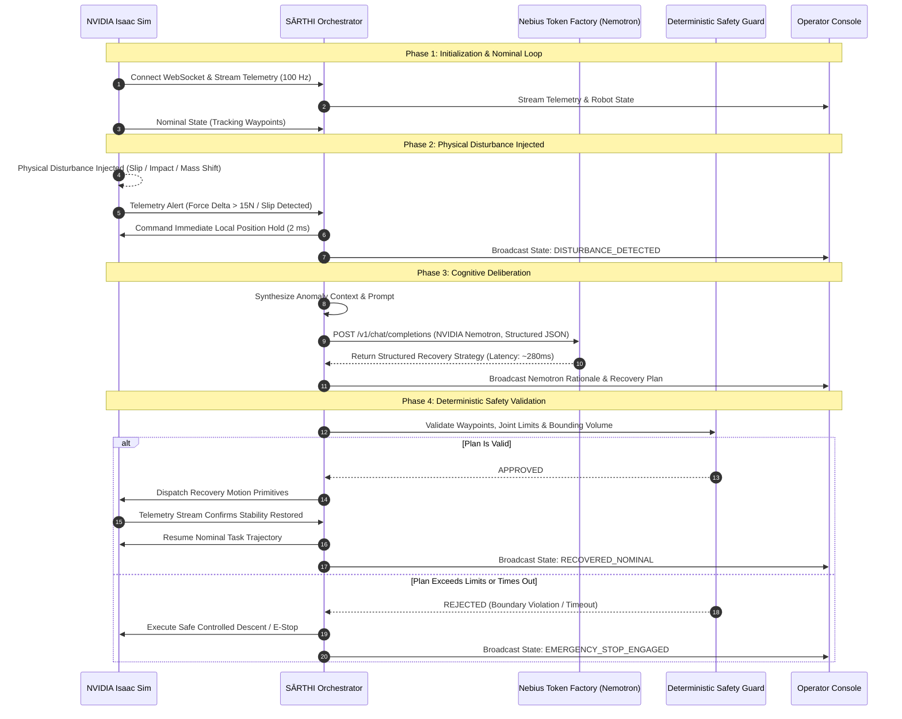

# SĀRTHI — Application Execution Flow

This document outlines the end-to-end operational lifecycle, communication handshakes, state transitions, and recovery execution loops of the **SĀRTHI** system.

---

## 1. High-Level Sequence Diagram

---

## 2. Operational Phases

### Phase 1: Initialization & System Handshake
1. **Simulation Stage Boot:** NVIDIA Isaac Sim launches the configured USD stage (`simulation/environments/workspace.usd`), initializing physics, the robotic manipulator, sensors, and the telemetry bridge.
2. **Backend Startup:** The FastAPI application initializes:
   - Verifies the `NEBIUS_API_KEY` and checks connectivity to the Nebius Token Factory endpoint.
   - Starts the WebSocket listener on port 8211.
   - Clears the telemetry ring buffer.
3. **Telemetry Handshake:** Isaac Sim establishes connection, streaming `TelemetrySnapshot` packets at 100 Hz. Backend begins streaming state to the Operator Dashboard.

---

### Phase 2: Nominal Task Execution
1. The robot receives a sequence of task waypoints (e.g., standard pick, lift, transfer, place).
2. The low-level trajectory generator publishes smooth joint targets to Isaac Sim.
3. The background disturbance detector continuously monitors sensor deltas against expected values:
   $$\Delta F = \| F_{\text{measured}} - F_{\text{expected}} \|$$
   $$\Delta p = \| p_{\text{measured}} - p_{\text{expected}} \|$$
4. As long as $\Delta F < F_{\text{thresh}}$ and $\Delta p < p_{\text{thresh}}$, execution proceeds in `NOMINAL` mode.

---

### Phase 3: Physical Disturbance Event
1. An unmodeled physical event occurs within Isaac Sim:
   - **Grasp Slip:** Surface friction drops or lateral inertial force exceeds gripper friction cone.
   - **External Collision:** Robot contacts an unmodeled dynamic obstacle.
   - **Payload Mass Shift:** Picked object is significantly heavier than nominal parameters.
2. The synthetic sensors register immediate state spikes (e.g., 6-axis F/T delta $> 15\text{ N}$, sudden deceleration, or slip contact flag).

---

### Phase 4: Detection & Local Safety Hold
1. Within 10 ms of the threshold crossing, the backend Disturbance Detector transitions system state to `DISTURBANCE_DETECTED`.
2. The backend sends an immediate command to the robot controller in Isaac Sim: **Engage Local Position Hold**.
3. The robot freezes along its nominal path using high-damping impedance control to prevent compounding kinematic error or physical damage.

---

### Phase 5: Cognitive Deliberation via Nebius Token Factory
1. The backend packages:
   - Recent 500 ms telemetry history (forces, joint errors, gripper status).
   - Current 3D pose and nominal goal coordinates.
   - Available recovery primitives: `regrasp`, `retract_along_normal`, `replan_path`, `adjust_compliance`, `controlled_drop`.
2. The backend constructs a structured prompt and sends a non-blocking asynchronous request to **NVIDIA Nemotron** via **Nebius Token Factory**.
3. Nebius Token Factory processes the request, delivering high-speed structured JSON containing:
   - Root-cause diagnosis (e.g., "Payload slippage detected due to low normal force along Y-axis").
   - Recommended recovery primitive and parametric setpoints.
   - Step-by-step reasoning trace.

---

### Phase 6: Deterministic Safety Validation
1. The raw strategy is parsed and fed directly into the `DeterministicSafetyValidator`.
2. The validator evaluates every synthesized waypoint against:
   - Manipulator joint limits: $q_{\min} \le q_i \le q_{\max}$.
   - Manipulator velocity limits: $|\dot{q}_i| \le \dot{q}_{\max}$.
   - Workspace boundaries: Ensures end-effector stays within safe physical envelope.
   - Static collision meshes.
3. **If Valid:** The plan is transformed into executable joint trajectories.
4. **If Invalid or Timeout ($> 450\text{ ms}$):** The safety filter overrides the model and commands a controlled gravitational resting stop.

---

### Phase 7: Closed-Loop Recovery Execution
1. The validated recovery primitives are dispatched to Isaac Sim.
2. The backend tracks sensory convergence:
   - For slip recovery: Confirms normal force stabilization and zero slip delta.
   - For collision detour: Confirms clearance from obstacle point cloud.
3. Once stable contact is verified, the system seamlessly transitions back to `NOMINAL` execution to complete the mission.

---

### Phase 8: Telemetry Archival & Feedback Loop
1. The full incident log (disturbance metrics, Nemotron inference duration, token usage, safety outcome) is committed to the local audit ring buffer.
2. Telemetry and cognitive reasoning traces are broadcast to the Operator Dashboard for real-time visualization and performance tracking.
