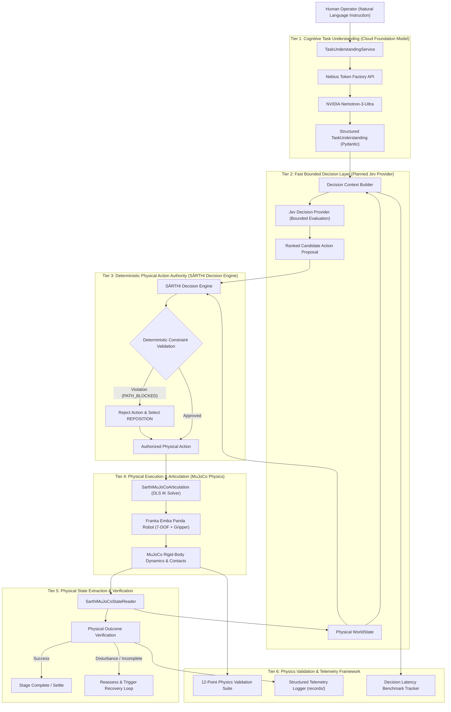

# SĀRTHI — System Architecture Specification

**Project Name:** SĀRTHI  
**Tagline:** An adaptive Physical AI architecture for context-aware, responsibility-driven robotic decision-making under changing physical conditions.  
**Target Event:** Nebius × NVIDIA Global AI Hackathon 2026  
**Document Version:** Version: 3.0  
**Status:** Draft — V3 Architecture Update  

---

## 1. Safety Architecture & Core Invariant

The entire architectural framework of SĀRTHI V3 is built upon a non-negotiable principle of separation of concerns between artificial intelligence inference and physical execution authority:

> [!IMPORTANT]
> **Core System Invariant:**  
> **"AI models propose or select bounded semantic candidates; deterministic software validates physical feasibility; only validated actions reach the robot controller."**  
> **"Jev must never bypass deterministic safety validation."**

No neural network or foundation model—including NVIDIA Nemotron and the planned Jev fast decision layer—commands robot motors directly or alters low-level control parameters without passing through the deterministic SĀRTHI Decision Engine.

---

## 2. Multi-Tier System Architecture

SĀRTHI V3 organizes robotic intelligence into decoupled, highly specialized tiers. Each tier has a single, well-defined operational responsibility:



### Decoupled Subsystem Responsibilities
$$\text{Nemotron} \neq \text{Jev} \neq \text{Decision Engine} \neq \text{Robot Controller}$$

- **NVIDIA Nemotron:** Interprets human language; extracts semantic goals and target entities; constructs high-level task plans.
- **Jev (Planned):** Evaluates bounded, discrete decision questions; rapidly scores and ranks candidate choices based on structured context.
- **SĀRTHI Decision Engine:** Sole physical action authority; enforces kinematic feasibility, clearance buffers, and safety guardrails; gates all actuation.
- **Robot Controller / MuJoCo:** Computes numerical inverse kinematics; steps rigid-body dynamics; enforces physical contact mechanics.

---

## 3. Tier 1: Cognitive Task Understanding (NVIDIA Nemotron)

### 3.1 Architectural Function
NVIDIA Nemotron functions exclusively at the top cognitive tier. It transforms open-ended human natural-language commands into structured, type-safe semantic representations.

### 3.2 Cloud Infrastructure: Nebius Token Factory
Inference is served via **Nebius Token Factory**, providing an enterprise OpenAI-compatible REST endpoint:
- **Model:** `nvidia/Nemotron-3-Ultra-550b-a55b`
- **Endpoint:** `https://api.tokenfactory.nebius.com/v1`
- **Output:** Pydantic-validated `TaskUnderstanding` specifying `target_object`, `destination_zone`, and expected high-level `required_actions` (e.g., `["APPROACH", "GRASP", "MOVE", "RELEASE"]`).

### 3.3 Boundary Restrictions
Nemotron does not observe raw numerical simulation state, joint vectors, or contact manifolds. It does not publish motor commands, modify `WorldState`, or interface directly with simulation controllers.

---

## 4. Tier 2: Fast Bounded Decision Layer (Jev — Planned)

### 4.1 Architectural Function
The **Jev Fast Decision Layer** is introduced in SĀRTHI V3 to provide fast, structured evaluation of discrete choices within a tightly bounded scope.

Rather than invoking a large generative model for runtime re-planning, SĀRTHI formulates targeted decision questions:
- *"Which recovery strategy is most appropriate for this disturbance?"*
- *"Which candidate action should be prioritized for the current physical phase?"*
- *"Does the current state deviation require initiating a recovery cycle?"*

### 4.2 Compact Decision Context
Raw simulation data is never forwarded to Jev. The `DecisionContextBuilder` extracts only the minimal semantic and physical signals required for the specific query:
```text
DecisionContext:
├── task_goal: "Transfer red_object to blue_target"
├── robot_phase: "POST_GRASP"
├── gripper_state: "CLOSED_HOLDING"
├── target_zone_coordinates: [0.40, -0.19, 0.12]
├── active_constraints: ["PATH_BLOCKED: blocking_barrier_01"]
├── clearance_delta_meters: -0.016
└── last_action_outcome: "REJECTED_BLOCKED_PATH"
```

### 4.3 Fallback & Zero Single-Point-of-Failure
Jev is accessed strictly via an abstract adapter interface (`JevDecisionProvider`). If the Jev provider experiences network latency, timeout, or schema parsing issues, the system immediately reverts to the **deterministic Decision Engine's native candidate-ranking heuristics**. Jev is never a single point of failure.

---

## 5. Tier 3: Deterministic Action Authority (SĀRTHI Decision Engine)

### 5.1 Sole Physical Authority
The **SĀRTHI Decision Engine** is the ultimate gatekeeper of the robotic system. Every candidate action—whether proposed by a baseline heuristic, task runner sequence, or Jev decision—must receive explicit cryptographic/boolean authorization from the Decision Engine prior to actuation.

### 5.2 Deterministic Constraint Checking
Candidate actions are projected forward and evaluated against active constraints:
1. **Workspace Bounding Envelopes:** Enforces physical Cartesian boundaries:
   $$x \in [0.1, 0.8]\text{ m}, \quad y \in [-0.5, 0.5]\text{ m}, \quad z \in [0.0, 0.8]\text{ m}$$
2. **Clearance & Obstacle Keepout:** Evaluates candidate paths against static and dynamic obstacle bounding boxes:
   $$d_{\text{trajectory, obstacle}} \ge d_{\text{required\_clearance}} \quad (0.082\text{ m})$$
   *(Validated benchmark: when obstacle enters transit path, minimum distance drops to $0.066\text{ m} < 0.082\text{ m}$, triggering deterministic rejection).*
3. **Reachability & Joint Feasibility:** Validates that candidate targets fall within Franka Panda kinematic reach and do not require violating joint limits.
4. **Grasp State Preconditions:** Enforces that `MOVE` actions cannot proceed unless `GRASP` contact stability is verified.

### 5.3 Autonomous Recovery Selection
When an action is rejected, the Decision Engine does not trigger a blind E-Stop. It analyzes the constraint failure and selects a compliant recovery primitive (e.g., `REPOSITION` to elevate the payload to $z \approx 0.35\text{ m}$, passing safely over the obstacle).

---

## 6. Tier 4: Physical Execution & Articulation (MuJoCo)

### 6.1 Robotic Platform & Physics Engine
- **Physics Engine:** MuJoCo (`mujoco >= 3.1.0`), providing deterministic multi-body dynamics, smooth contact resolution, and collision geometry.
- **Robot Model:** Franka Emika Panda (7-DOF arm, 2-finger parallel gripper) sourced from MuJoCo Menagerie.

### 6.2 Numerical Articulation
`SarthiMuJoCoArticulation` executes approved Cartesian waypoints using Damped-Least-Squares (DLS) differential inverse kinematics:
$$\Delta q = J^T (J J^T + \lambda^2 I)^{-1} \Delta x$$
with joint-limit clipping, velocity limit enforcement, and controlled simulation stepping.

---

## 7. Tier 5: Physical State Extraction & Verification

### 7.1 Real-Time State Reader
`SarthiMuJoCoStateReader` translates active MuJoCo simulation structures (`mjModel` and `mjData`) directly into canonical SĀRTHI Pydantic models:
- Real-time end-effector pose, joint positions, and joint velocities.
- Object spatial coordinates and bounding geometry.
- Live contact manifold analysis: determining whether fingers contact the object, normal force magnitude, and slip status.

### 7.2 Post-Condition Physical Verification
Every action execution is verified against empirical simulation metrics:
- **`APPROACH_VERIFIED`:** End-effector reached pre-grasp standoff within tolerance.
- **`GRASP_VERIFIED`:** Parallel jaws clamped object with persistent normal forces.
- **`REPOSITION_VERIFIED`:** Object elevated above clearance altitude ($z \ge 0.33\text{ m}$).
- **`FINAL_PLACEMENT_VERIFIED`:** Object settled in target zone (validated benchmark error $0.0535\text{ m} \le 0.0600\text{ m}$).

---

## 8. Tier 6: Physics Validation Framework (New V3 Requirement)

The Physics Validation Framework establishes rigorous, repeatable benchmarks across 12 physical dimensions:

1. **Timestep Sensitivity:** Testing trajectory convergence across multiple physics timestep configurations ($dt \in \{0.001\text{s}, 0.002\text{s}, 0.005\text{s}\}$).
2. **Joint-Limit Correctness:** Verifying that commanded motions never violate Franka Panda mechanical limits.
3. **Joint Velocity Limits:** Ensuring commanded velocities remain within configured safety thresholds.
4. **EE Trajectory Repeatability:** Measuring Cartesian trajectory variance across identical repeated runs.
5. **Contact Stability:** Verifying sustained grasp firmness over extended simulation holding periods.
6. **Object Placement Repeatability:** Quantifying final resting position variance across repeated release trials.
7. **Collision/Clearance Validation:** Confirming deterministic rejection when obstacle clearance falls below threshold.
8. **Gravity & Settling Behavior:** Validating Newtonian settling acceleration and resting stability.
9. **IK Convergence Residuals:** Measuring numerical error and iteration counts of the DLS solver.
10. **Numerical Stability:** Detecting and preventing non-finite floating-point states (`NaN`, `Inf`).
11. **Deterministic Replay:** Validating identical execution trajectories from identical random seeds and initial states.
12. **Physics Regression Testing:** Automatically benchmarking code changes against established baseline telemetry.

---

## 9. Latency Instrumentation & Decision Performance

SĀRTHI V3 instruments every stage of the decision and actuation lifecycle to empirically quantify the latency profile:

| Stage Metric | Latency Symbol | Measured Interval | Target Profile |
| :--- | :--- | :--- | :--- |
| **Task Understanding** | $\tau_{\text{nemotron}}$ | Command reception $\to$ `TaskUnderstanding` | Cloud LLM roundtrip (instrumented via Nebius) |
| **Context Synthesis** | $\tau_{\text{context}}$ | WorldState inspection $\to$ `DecisionContext` | Local in-process memory aggregation |
| **Fast Bounded Decision** | $\tau_{\text{jev}}$ | Bounded query dispatch $\to$ `JevDecision` | Fast structured decision latency (to be benchmarked) |
| **Constraint Validation** | $\tau_{\text{validation}}$ | Candidate evaluation $\to$ `Decision` | Sub-millisecond deterministic calculation |
| **Trajectory Synthesis** | $\tau_{\text{ik}}$ | Cartesian target $\to$ joint path interpolation | DLS differential IK stepping |
| **Physical Actuation** | $\tau_{\text{sim}}$ | Joint torque execution in MuJoCo | Physics step loop duration |
| **Physical Verification** | $\tau_{\text{verify}}$ | Post-motion inspection $\to$ verification status | In-process `mjData` extraction |

---

## 10. Security Boundaries & Isolation

1. **Strict Credential Isolation:** All authentication keys (`NEBIUS_API_KEY`, Jev credentials) are loaded from process environment variables and scrubbed from all logs, exceptions, and telemetry records.
2. **Air-Gapped Actuation:** The physical simulation runs locally via direct Python C-bindings. Neither cloud models nor third-party decision layers have network access to simulator controls.
3. **Graceful Degradation:** Any network failure, schema error, or API timeout results in an immediate transition to a local deterministic position hold or controlled gravitational stop.
