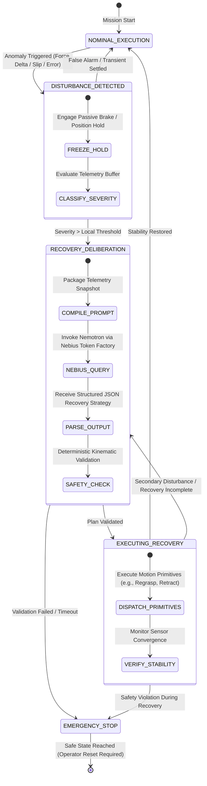

# SĀRTHI — System Architecture Specification

## 1. Executive Summary

**SĀRTHI** is an adaptive Physical AI architecture designed for context-aware, responsibility-driven robotic decision-making under changing physical conditions. It is engineered to bridge the divide between high-level cognitive deliberation and real-time physical control.

Robotic systems operating in dynamic, real-world environments continuously experience unpredictable physical disturbances:
- Micro-slips and complete loss of grasp friction
- External impact and unexpected collision forces
- Mass and center-of-gravity shifts during payload manipulation
- Visual occlusions and dynamic path blockages

SĀRTHI addresses this challenge through a multi-tier, closed-loop architecture that combines **NVIDIA Nemotron** reasoning powered by **Nebius Token Factory** with the high-fidelity physics and sensor modeling of **NVIDIA Isaac Sim**.

---

## 2. Multi-Tier Architecture Diagram

```mermaid
graph TB
    subgraph CognitiveTier ["1. Cognitive & Deliberative Tier (Cloud)"]
        direction TB
        NTF["Nebius Token Factory (Inference Infrastructure)"]
        Nemotron["NVIDIA Nemotron (High-Reasoning Foundation Model)"]
        PromptEngine["Structured Prompt & Context Synthesizer"]
        
        PromptEngine --> NTF
        NTF --> Nemotron
        Nemotron -->|Structured Recovery Plan (JSON)| PlanParser["Recovery Plan Parser & Verifier"]
    end

    subgraph OrchestrationTier ["2. Orchestration & Safety Tier (Backend Runtime)"]
        direction TB
        StateStore["Real-Time State Store & Telemetry Ring-Buffer"]
        DisturbanceDetector["Disturbance & Anomaly Detector"]
        SafetyValidator["Deterministic Kinematic & Boundary Validator"]
        ActionCoordinator["Action & Motion Primitive Coordinator"]
        
        StateStore --> DisturbanceDetector
        DisturbanceDetector -->|Anomaly Detected| PromptEngine
        PlanParser --> SafetyValidator
        SafetyValidator -->|Validated Trajectory/Command| ActionCoordinator
    end

    subgraph SimulationTier ["3. Physical Perception & Simulation Tier (NVIDIA Isaac Sim)"]
        direction TB
        IsaacUSD["Omniverse USD Environment Stage"]
        PhysX["PhysX 5 Dynamics & Contact Solver"]
        VirtualRobot["Articulated Manipulator / Mobile Base"]
        SensorRig["Synthetic Sensors (F/T, Joint Encoders, RGB-D)"]
        DisturbanceEngine["Disturbance Injection Module"]
        
        IsaacUSD --> PhysX
        PhysX --> VirtualRobot
        VirtualRobot --> SensorRig
        DisturbanceEngine -.->|Force / Inertia / Slip Impulse| VirtualRobot
    end

    subgraph InterfaceTier ["4. Observability & Operator Tier"]
        OperatorUI["Operator Console & Telemetry Visualizer"]
        TelemetryWS["WebSocket Streamer (gRPC/WS)"]
    end

    %% Cross-Tier Connections
    SensorRig -->|High-Frequency Telemetry (100Hz)| StateStore
    ActionCoordinator -->|Joint Commands / Velocity Targets| VirtualRobot
    StateStore --> TelemetryWS
    TelemetryWS --> OperatorUI
    OperatorUI -->|Manual Disturbance Trigger| DisturbanceEngine
```

---

## 3. Tier Specifications

### 3.1 Tier 1: Cognitive & Deliberative Tier
- **NVIDIA Nemotron:** Acts as the high-level cognitive reasoner. Rather than processing high-frequency raw sensor streams directly, Nemotron is invoked asynchronously when the system detects state deviations beyond nominal recovery thresholds.
- **Nebius Token Factory:** Provides low-latency, high-throughput cloud inference for Nemotron. It ensures that complex robotic reasoning queries return within strict time budgets (< 400 ms), making cognitive recovery viable within interactive control horizons.
- **Structured Schema Enforcement:** All outputs from Nemotron conform to strict JSON schemas defined in [BACKEND_SCHEMA.md](file:///d:/Projects/SĀRTHI/BACKEND_SCHEMA.md), including recovery primitives, grasp adjustments, and diagnostic rationale.

### 3.2 Tier 2: Orchestration & Safety Tier
- **State Store & Ring-Buffer:** Ingests 100 Hz robotic telemetry (joint positions, velocities, torques, end-effector pose, contact forces) and maintains a sliding temporal window of the last 3 seconds.
- **Disturbance Detector:** Continuously compares observed state against nominal trajectory expectations. Detects anomalies such as unexpected force deltas ($> 15\text{ N}$), excessive tracking error ($> 0.05\text{ m}$), or zero-friction slip signatures.
- **Deterministic Safety & Boundary Validator:** A strict, non-negotiable safety guardrail. Every plan generated by Nemotron is validated against:
  - Joint limit and velocity limits
  - Workspace bounding volume
  - Self-collision and static environment collision geometry
  - Emergency brake triggers if the LLM output is malformed or physically invalid

### 3.3 Tier 3: Physical Perception & Simulation Tier (NVIDIA Isaac Sim)
- **NVIDIA Isaac Sim:** Provides photorealistic rendering and physically accurate dynamics powered by NVIDIA PhysX 5.
- **Synthetic Sensors:**
  - 6-Axis Force/Torque Sensor at the end-effector.
  - Articulated Joint Encoders (position, velocity, effort).
  - Synthetic RGB-D Depth Camera for workspace clearance validation.
- **Disturbance Injection Module:** A dedicated testing harness within Isaac Sim that can programmatically apply external impulses, simulate sudden mass increases, drop surface friction coefficients, or introduce dynamic obstacles.

### 3.4 Tier 4: Observability & Operator Tier
- **WebSocket Streaming:** Broadcasts real-time robot state, active disturbance status, and Nemotron reasoning logs to client interfaces.
- **Operator Dashboard:** A production console providing live telemetry graphs, a 3D viewport, and interactive disturbance injection controls.

---

## 4. Disturbance Detection & Recovery Lifecycle



---

## 5. Latency Budget & Timing Constraints

To maintain robotic stability while executing cloud-assisted cognitive re-planning, the system adheres to the following latency budget:

| Operation | Target Latency | Max Allowable Latency | Fallback Behavior |
| :--- | :--- | :--- | :--- |
| **Telemetry Ingestion & Filtering** | 10 ms | 20 ms | Drop frame, use prior state |
| **Disturbance Anomaly Detection** | 5 ms | 15 ms | Conservative brake trigger |
| **Robot Position Hold (Local)** | 2 ms | 5 ms | Local hardware safety clamp |
| **Nemotron Cloud Inference (Nebius)** | 250 ms | 450 ms | Local canned recovery primitive |
| **Deterministic Kinematic Check** | 3 ms | 10 ms | Reject plan, enter safe stop |
| **Total Recovery Deliberation Horizon**| **~270 ms**| **< 500 ms**| Safe descent / passive hold |

---

## 6. Security, Isolation, and Robustness

1. **Air-Gapped Actuation Separation:** The LLM never writes directly to hardware motor registers. It generates high-level symbolic recovery primitives (`regrasp`, `replan_trajectory`, `adjust_compliance`), which are translated into joint trajectories by deterministic local controllers.
2. **Deterministic Fallbacks:** If the Nebius Token Factory endpoint is unreachable or response latency exceeds 500 ms, the system automatically falls back to deterministic rule-based compliance routines or triggers a controlled gravitational stop.
3. **Environment & Secret Protection:** All API credentials for Nebius Token Factory are managed via strictly scoped environment variables, isolated from client-facing services.
