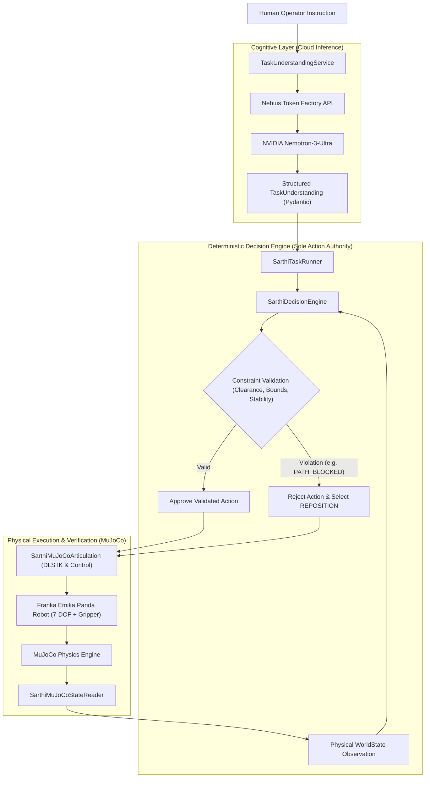

# SĀRTHI

> **SĀRTHI is an adaptive Physical AI architecture for context-aware, responsibility-driven robotic decision-making under changing physical conditions.**

Developed for the **Nebius × NVIDIA Global AI Hackathon 2026**.

---

## Problem Statement

Robotic systems can encounter unexpected physical changes after an action plan has already been selected. Conventional open-loop planners and static execution pipelines fail when environmental dynamics diverge from initial assumptions—such as an obstacle suddenly blocking a transit path, an object shifting in grasp, or clearance bounds changing mid-task.

SĀRTHI demonstrates a closed-loop approach in which the robot observes the updated world state, validates candidate actions against constraints, rejects unsafe or invalid actions, and selects a recovery action when the environment changes.

---

## System Architecture

SĀRTHI strictly decouples cognitive semantic parsing from deterministic physical execution authority:

```text
Human instruction
        ↓
Task Understanding — Nemotron via Nebius Token Factory
        ↓
World-state observation
        ↓
Deterministic Decision Engine
        ↓
Constraint validation
        ↓
Physical action execution
        ↓
Verification
        ↓
Reassessment / recovery
        ↺
```

### Architectural Separation & Safety Invariant



> [!IMPORTANT]
> **Core Architectural Invariant:**
> - **NVIDIA Nemotron** performs natural-language task understanding (extracting high-level targets, intended goals, and semantic actions).
> - The **deterministic Decision Engine** remains the sole physical action authority, evaluating physical kinematics, clearance constraints, and candidate action ranking.
> - Nemotron does **NOT** directly command robot motors or output raw joint trajectories.

---

## Technology Stack

- **Language & Runtime:** Python 3.10+ (asyncio, type annotations)
- **Cognitive Foundation Model:** NVIDIA Nemotron (`nvidia/Nemotron-3-Ultra-550b-a55b`)
- **Cloud Inference Platform:** Nebius Token Factory (high-throughput OpenAI-compatible endpoint)
- **Physics Simulation Engine:** MuJoCo (`mujoco >= 3.1.0`)
- **Robot Manipulator:** Franka Emika Panda (7-DOF arm with parallel-jaw gripper, sourced from MuJoCo Menagerie)
- **Data Contracts & Schemas:** Pydantic v2 (type-safe, validated telemetry and task interfaces)
- **Deterministic Action Authority:** SĀRTHI Decision Engine (constraint validation, collision avoidance, and autonomous recovery selection)

---

## Live Model Integration: Nebius Token Factory & NVIDIA Nemotron

SĀRTHI integrates with **Nebius Token Factory** for low-latency foundation model inference.

- **Model Identifier:** `nvidia/Nemotron-3-Ultra-550b-a55b`
- **Inference Endpoint:** `https://api.tokenfactory.nebius.com/v1`
- **Role:** Extracts semantic intent (`TaskUnderstanding`) from unstructured human language (e.g., resolving target object identity, destination zone, and task sequence).
- **Security & Configuration:** API credentials are authenticated strictly via environment variables (`NEBIUS_API_KEY`, `NEBIUS_BASE_URL`, `NEBIUS_MODEL`). No credentials or secret keys are stored in the codebase or version control.
- For complete provider setup and integration details, see [docs/NEBIUS_TOKEN_FACTORY.md](docs/NEBIUS_TOKEN_FACTORY.md).

---

## Implemented & Validated Benchmark

The complete closed-loop pipeline has been verified through an embodied pick-and-place manipulation task under dynamic physical disturbance:

### Task
`"Move the red object to the blue target."`

### Simulation Environment
MuJoCo physics with a 7-DOF Franka Emika Panda arm, a red manipulateable object ($0.04 \times 0.04 \times 0.04\text{ m}$ cube), a blue destination zone, and a dynamic obstacle ($0.08 \times 0.08 \times 0.16\text{ m}$ column).

### Dynamic Disturbance
A physical blocking obstacle is introduced along the direct transit trajectory after the robot has completed the `GRASP` phase and before the planned `MOVE`.

### Observed Autonomous Recovery Flow
1. **Initial Execution:** Robot executes `APPROACH` and `GRASP`, establishing firm physical contact with the red object.
2. **Disturbance Detection:** The obstacle activates in the transit corridor (`PATH_BLOCKED`).
3. **Constraint Enforcement:** Candidate `MOVE` action evaluated against active world state.
   - Minimum trajectory clearance to obstacle: **`0.066 m`**
   - Required safety clearance: **`0.082 m`**
   - Action rejected by the Decision Engine due to constraint violation.
4. **Autonomous Re-planning:** SĀRTHI Decision Engine evaluates alternatives and selects `REPOSITION`.
5. **Recovery Execution:** Robot lifts and repositions the grasped object above the obstacle (elevation $z \approx 0.333\text{–}0.351\text{ m}$), safely clearing the collision manifold.
6. **Delivery & Placement:** Robot executes the cleared `MOVE` trajectory to the target destination zone.
7. **Release & Settle:** `RELEASE` executed; object settles under gravity on the target zone.
8. **Final Verification Metrics:**
   - **Recovery count:** `1`
   - **Final placement error:** **`0.0535 m`**
   - **Allowed placement tolerance:** **`0.0600 m`**
   - **Task Outcome:** Successfully Completed (`Status: COMPLETED`)

Detailed validation logs, contact telemetry, and IK convergence analyses are documented in [docs/MUJOCO_VALIDATION.md](docs/MUJOCO_VALIDATION.md).

---

## Automated Test Suite

SĀRTHI is validated by an automated unit and integration test suite:

```text
Ran 366 tests in 49.709s

OK (366 passed, 0 failed, 0 errors)
```

The test suite validates:
- Damped-Least-Squares (DLS) inverse kinematics and joint limit clipping
- Deterministic constraint checking and collision boundary projection
- Live MuJoCo state extraction into canonical Pydantic schemas
- Runtime action dispatch, physical verification, and dynamic recovery loops
- Nebius Token Factory provider integration (both live and offline mocked modes)
- Local Laya bounded decision integration and candidate action injection
- Complete 12-dimensional physics validation (IK, contact, stability, timesteps)
- Multi-run reproducibility and deterministic replay
- 13 controlled failure scenarios and multi-tier resiliency fallback suite
- Visual demonstration event streams and security sanitization

---

## Running the Validated Demo

All validation commands use already implemented scripts and configurations:

### 1. Judge-Ready Visual Demonstration (Live Mode)
Runs the complete cognitive-to-physical pipeline with real Nemotron, real local Laya, authoritative Decision Engine, MuJoCo Franka Panda, and dynamic obstacle recovery:
```powershell
.venv\Scripts\python.exe scripts\run_v3_11_demo.py --mode live
```

### 2. Offline Replay Mode
Plays back recorded telemetry offline without requiring API keys or active neural endpoints:
```powershell
.venv\Scripts\python.exe scripts\run_v3_11_demo.py --mode replay
```

### 3. Local Web Dashboard
Launches the lightweight, dependency-free visual presentation dashboard at `http://127.0.0.1:8080`:
```powershell
.venv\Scripts\python.exe scripts\run_v3_11_demo.py --serve --port 8080
```

### 4. Resiliency & Failure Fallback Demo
Demonstrates deterministic recovery when decision services experience network or model timeouts:
```powershell
.venv\Scripts\python.exe scripts\run_v3_11_demo.py --mode failure
```

### 5. Full Automated Test Suite
Executes all 366 unit, integration, and E2E recovery tests across the repository:
```powershell
.venv\Scripts\python.exe -m unittest discover -s tests -p "test_*.py"
```

Structured telemetry and execution records are persisted under [`records/`](records/).

---

## Current Scope and Limitations

To maintain rigorous technical transparency, the current operational scope and validated boundaries are:
- **Tabletop Manipulation:** Currently validated on a tabletop pick-and-place manipulation scenario.
- **Disturbance Profile:** Currently validated on dynamic transit path blockage (`PATH_BLOCKED`).
- **Simulation Validation:** Validated in high-fidelity rigid-body physics simulation (MuJoCo). Direct physical hardware validation has not yet been performed.
- **Future Scope:** Expanding to dynamic multi-obstacle avoidance, deformable object manipulation, slippage compensation under variable friction, and real-world Franka Panda hardware deployment.

---

## Repository Structure

```text
sarthi/
├── LICENSE                             # MIT License
├── README.md                           # Project overview, architecture & validation guide
├── FEEDBACK.md                         # Technical evaluation notes & validation evidence
├── backend/                            # Core SĀRTHI orchestration & decision engine
│   └── app/
│       ├── decision/                   # Deterministic SĀRTHI Decision Engine & constraints
│       ├── model/                      # Canonical Pydantic schemas (WorldState, Actions)
│       ├── orchestration/              # SarthiTaskRunner & TaskUnderstandingService
│       └── providers/                  # Nebius Token Factory / Nemotron provider
├── simulation/
│   ├── mujoco_assets/                  # SĀRTHI MuJoCo scene XMLs & Franka Panda MJCF
│   └── mujoco_runtime/                 # Runtime execution, IK articulation & state reader
├── records/                            # Structured JSON execution telemetry & run records
├── docs/
│   ├── MUJOCO_VALIDATION.md            # MuJoCo physics validation & telemetry guide
│   ├── NEBIUS_TOKEN_FACTORY.md         # Nebius Token Factory integration guide
│   └── ARCHITECTURE.md                 # Deep-dive system architecture specification
├── scripts/
│   └── mujoco/                         # E2E demo runner (headless, viewer, mock)
├── tests/                              # 186 unit, integration, and E2E recovery tests
└── configs/                            # Simulation and provider configurations
```

---

## License & Third-Party Attribution

- **SĀRTHI Core:** Released under the [MIT License](LICENSE).
- **Franka Emika Panda MJCF Model:** Sourced from [MuJoCo Menagerie](https://github.com/google-deepmind/mujoco_menagerie/tree/main/franka_emika_panda) (Google DeepMind / Franka Emika GmbH), licensed under Apache 2.0. Upstream model definitions remain unmodified.
