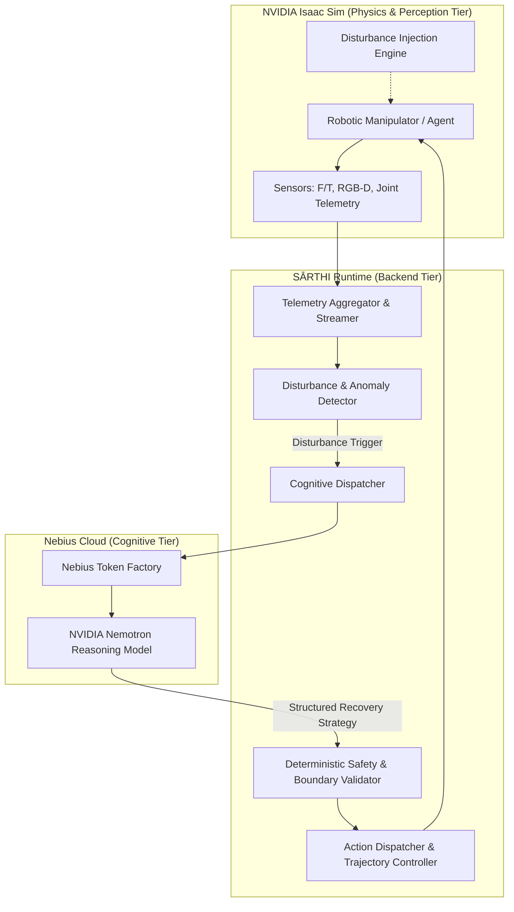

# SĀRTHI

> **An adaptive Physical AI architecture for context-aware, responsibility-driven robotic decision-making under changing physical conditions.**

Developed for the **Nebius × NVIDIA Global AI Hackathon 2026**.

---

## Overview

Modern robotic control systems struggle when physical reality deviates from idealized models. Unexpected slips, sudden payload mass shifts, friction variations, and external dynamic obstacles often cause hard failures or catastrophic stalls in conventional open-loop planners.

**SĀRTHI** is an adaptive Physical AI architecture designed to close the gap between high-level cognitive reasoning and low-level deterministic robotic control. By integrating high-throughput cloud inference with high-fidelity physics simulation, SĀRTHI continuously evaluates physical contact dynamics, predicts operational risks, and executes autonomous recovery behaviors under dynamic environmental disturbances.

---

## Core Pillars & Key Technologies

### 1. High-Reasoning Cognitive Engine: NVIDIA Nemotron
SĀRTHI utilizes **NVIDIA Nemotron** as its core cognitive reasoner. When low-level controllers detect physical state violations, Nemotron analyzes structured sensor observations, operational constraints, and failure symptoms to formulate context-aware recovery tactics, alternative task decompositions, and responsibility-driven risk mitigations.

### 2. High-Throughput Inference Infrastructure: Nebius Token Factory
Robotic decision loops require predictable, ultra-low-latency language model inference. SĀRTHI leverages **Nebius Token Factory** to deploy and query NVIDIA Nemotron with enterprise-grade token generation speed, high concurrency, and low latency, enabling near real-time re-planning without compromising cognitive depth.

### 3. High-Fidelity Physics Simulation: NVIDIA Isaac Sim
All physical interactions, sensor streams, and dynamic disturbances are modeled inside **NVIDIA Isaac Sim**, powered by Omniverse and PhysX 5. Isaac Sim provides accurate contact dynamics, synthetic depth and RGB perception, IMU and force/torque feedback, and programmable disturbance injection to rigorously validate robotic behaviors.

### 4. Adaptive Decision-Making
Rather than relying on static decision trees, SĀRTHI executes **adaptive decision-making**:
- Dynamically reassessing grasp quality, trajectory clearance, and force limits during movement.
- Balancing task urgency against physical stability margins.
- Transitioning smoothly between nominal execution, safety hold, cognitive re-planning, and recovery actions.

### 5. Physical-World Disturbance and Recovery
The central engineering objective of SĀRTHI is robust **physical-world disturbance and recovery**:
- **Disturbance Ingestion:** Detects physical slips, sudden torque spikes, collisions, and path blockages in real time.
- **Responsibility Classification:** Analyzes whether the disturbance warrants local compliance, a strategic re-grasp, trajectory detour, or a controlled safe halt.
- **Closed-Loop Recovery:** Generates and executes corrective motion primitives within NVIDIA Isaac Sim, confirming state stability before resuming nominal objectives.

---

## Architecture at a Glance



---

## Repository Structure

```text
sarthi/
├── LICENSE                 # MIT License
├── README.md               # Project overview & architectural vision
├── FEEDBACK.md             # Feedback capture, review notes & evaluation rubric
├── .gitignore              # Production gitignore for Python, Isaac Sim & Node
├── ARCHITECTURE.md         # Deep-dive system architecture specification
├── PRD.md                  # Product Requirements Document
├── TRD.md                  # Technical Requirements Document
├── APP_FLOW.md             # End-to-end execution flow & sequence diagrams
├── UI_UX.md                # Operator dashboard & telemetry console specifications
├── BACKEND_SCHEMA.md       # Pydantic & JSON data contracts and interfaces
├── IMPLEMENTATION_PLAN.md   # Phased engineering roadmap
├── backend/                # FastAPI backend & orchestration service
│   └── app/                # Core application package
├── frontend/               # Operator dashboard & telemetry visualizer
├── simulation/             # NVIDIA Isaac Sim assets, environments & configs
├── configs/                # System, model, and simulation configurations
├── scripts/                # Utility scripts & verification tooling
├── tests/                  # Unit, integration, and recovery benchmarks
└── docs/                   # Extended design documentation & specifications
```

---

## Prerequisites & Target Environment

- **Inference:** Nebius Token Factory API access (API Key & endpoint for NVIDIA Nemotron).
- **Simulation:** NVIDIA Isaac Sim 4.0+ (requires NVIDIA RTX GPU with CUDA 12.x support).
- **Backend:** Python 3.10+ with asyncio and FastAPI.
- **Operating System:** Ubuntu 22.04 LTS / Windows 11 with WSL2 / Native Windows for Python orchestration.

---

---

## MuJoCo Physical AI Validation

SĀRTHI includes a MuJoCo-based physical simulation backend used to validate:
- **Embodied Decision-Making**: Translating cognitive goals into verifiable physical action sequences.
- **Physical Action Execution**: Inverse kinematics and joint control of a 7-DOF Franka Emika Panda arm.
- **Disturbance Handling**: Injecting dynamic physical obstacles (`PATH_BLOCKED`) post-grasp.
- **Adaptive Recovery**: Autonomous rejection of collision paths and deterministic selection of recovery behaviors.
- **State Verification**: Continuous physical evidence extraction from simulation contacts and coordinates.

### Technology Stack & Roles
- **NVIDIA Nemotron**: Operates in the cognitive layer to parse human natural-language instructions into structured task semantics (`TaskUnderstanding`).
- **Nebius Token Factory**: Provides high-throughput, low-latency cloud inference hosting for NVIDIA Nemotron.
- **MuJoCo**: Provides the deterministic physics engine modeling rigid-body dynamics, contact mechanics, and collision manifolds.
- **SĀRTHI Decision Engine**: Serves as the sole deterministic physical-action authority, evaluating constraints and ranking candidate actions.

For complete execution instructions and telemetry schemas, see [docs/MUJOCO_VALIDATION.md](file:///d:/Projects/SĀRTHI/docs/MUJOCO_VALIDATION.md).

---

## License & Third-Party Attribution

- **SĀRTHI Core**: Licensed under the MIT License - see the [LICENSE](file:///d:/Projects/SĀRTHI/LICENSE) file for details.
- **Franka Emika Panda MJCF Model**: Sourced from [MuJoCo Menagerie](https://github.com/google-deepmind/mujoco_menagerie/tree/main/franka_emika_panda) (Google DeepMind / Franka Emika GmbH), licensed under Apache 2.0. Upstream model files remain unmodified and are included in scenario compositions.
